# Clickstream Analytics

## Введение

### Описание проекта

Проект **Clickstream Analytics** — система сбора, обработки и анализа пользовательских событий (clickstream) в режиме реального времени и пакетной обработки.

**Объект разработки** — поток clickstream-событий (клики, просмотры страниц, покупки, регистрации, входы/выходы), генерируемых пользователями веб-приложений.

**Предмет разработки** — распределённая архитектура для:
- Приёма событий через HTTP API и Apache Kafka
- Хранения в колоночном OLAP-хранилище ClickHouse
- ETL-обработки через Apache Airflow
- Визуализации в Superset и Grafana

### Стек технологий

| Компонент | Технология | Назначение |
|-----------|------------|------------|
| **API Server** | C++ (custom HTTP server) | Приём событий по HTTP, валидация, запись в ClickHouse |
| **Event Generator** | C++ | Генерация тестовых событий (HTTP, Kafka, MinIO) |
| **Message Broker** | Apache Kafka 3.7 (KRaft, 3 брокера) | Буферизация и доставка событий |
| **Data Warehouse** | ClickHouse | Хранение сырых и агрегированных данных |
| **Object Storage** | MinIO | Хранение CSV-файлов для batch-загрузки |
| **ETL Orchestration** | Apache Airflow | Оркестрация DAG-ов обработки данных |
| **BI Dashboards** | Apache Superset | Бизнес-аналитика и визуализация |
| **Monitoring** | Prometheus + Grafana | Мониторинг инфраструктуры и метрик |
| **Metadata DB** | PostgreSQL | Метаданные Airflow и Superset |

---

## Запуск

### Требования
- Docker 24+ и Docker Compose v2
- 8 GB RAM минимум (рекомендуется 16 GB)
- 10 GB свободного места на диске

### Запуск одной командой
```bash
docker compose up -d
```

После старта всех контейнеров включите DAG-и в Airflow (http://localhost:8080) — прежде всего пайплайн загрузки CSV и витрин (`dag_01_csv_ingest`, `dag_02_prepare_events`, `dag_03_fill_analytics_marts`). После успешного прогона переходите к дашбордам Superset и мониторингу Grafana.

### Адреса сервисов (localhost)

| Сервис | URL | Credentials |
|--------|-----|-------------|
| **API Server** | http://localhost:8081 | — |
| **Kafka UI** | http://localhost:8082 | — |
| **ClickHouse HTTP** | http://localhost:8123 | clickstream / clickstream123 |
| **ClickHouse Native** | localhost:9000 | clickstream / clickstream123 |
| **Airflow** | http://localhost:8080 | airflow / airflow |
| **Prometheus** | http://localhost:9090 | — |
| **Grafana** | http://localhost:3001 | admin / admin |
| **Superset** | http://localhost:8088 | admin / admin |
| **MinIO Console** | http://localhost:9001 | minio / minio123 |

---

## Основная часть

### Анализ предметной области

#### Обоснование выбора архитектуры

Система построена по принципу **Lambda Architecture** с разделением на:

1. **Speed Layer (Real-time)**: HTTP API → ClickHouse, Kafka → ClickHouse
2. **Batch Layer**: MinIO CSV → Airflow DAGs → ClickHouse
3. **Serving Layer**: ClickHouse analytics.* → Superset/Grafana

**Почему такая архитектура:**
- **Масштабируемость**: Kafka обеспечивает горизонтальное масштабирование приёма событий
- **Отказоустойчивость**: 3 брокера Kafka с replication-factor=2, репликация ClickHouse
- **Гибкость**: Несколько путей ingestion (HTTP, Kafka, CSV) для разных сценариев
- **Производительность**: ClickHouse обрабатывает миллионы событий в секунду

#### Обзор существующих решений

| Решение | Плюсы | Минусы |
|---------|-------|--------|
| Google Analytics | Готовое решение, простота | Vendor lock-in, ограничения по данным |
| Snowplow | Open-source, гибкость | Сложность настройки, высокие требования |
| Segment | Интеграции, простота | Дорого, ограничения |
| **Наше решение** | Полный контроль, гибкость, низкая стоимость | Требует DevOps-экспертизы |

#### Описание стека по компонентам

**C++ API Server**: Выбран для минимальной latency (~1ms на запрос) и низкого потребления памяти. Использует epoll для асинхронной обработки соединений.

**Apache Kafka (KRaft)**: Бесзукиперная конфигурация для упрощения операций. 6 партиций топика для параллельной обработки.

**ClickHouse**: Колоночное хранилище с компрессией LZ4, поддержка ReplacingMergeTree для дедупликации, Materialized Views для валидации.

**Apache Airflow**: DAG-based оркестрация с retry-логикой, мониторингом, и watermark-based инкрементальной обработкой.

---

### Проектирование

#### Архитектура приложения

##### Расчёт нагрузки и ресурсов

**Требования к ресурсам:**

| Компонент | CPU | RAM | Disk |
|-----------|-----|-----|------|
| API Server | 1 core | 256 MB | — |
| Kafka (×3) | 1 core each | 1 GB each | 10 GB each |
| ClickHouse | 2 cores | 4 GB | 50 GB (30-day retention) |
| Airflow | 1 core | 2 GB | 5 GB |
| Prometheus | 0.5 core | 1 GB | 10 GB |
| **Total** | ~8 cores | ~12 GB | ~100 GB |

##### UML-диаграммы

Диаграммы находятся в [docs/diagrams/](docs/diagrams/):

**1. Use Case Diagram** — [use_case.puml](docs/diagrams/use_case.puml)
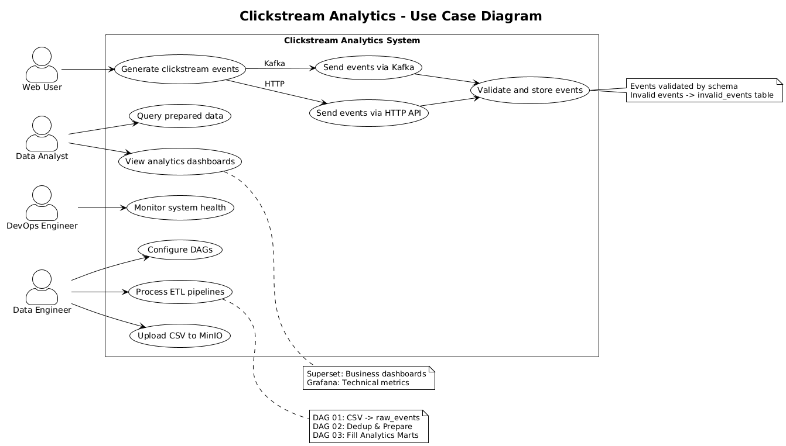

**2. Sequence Diagram** — [sequence.puml](docs/diagrams/sequence.puml)
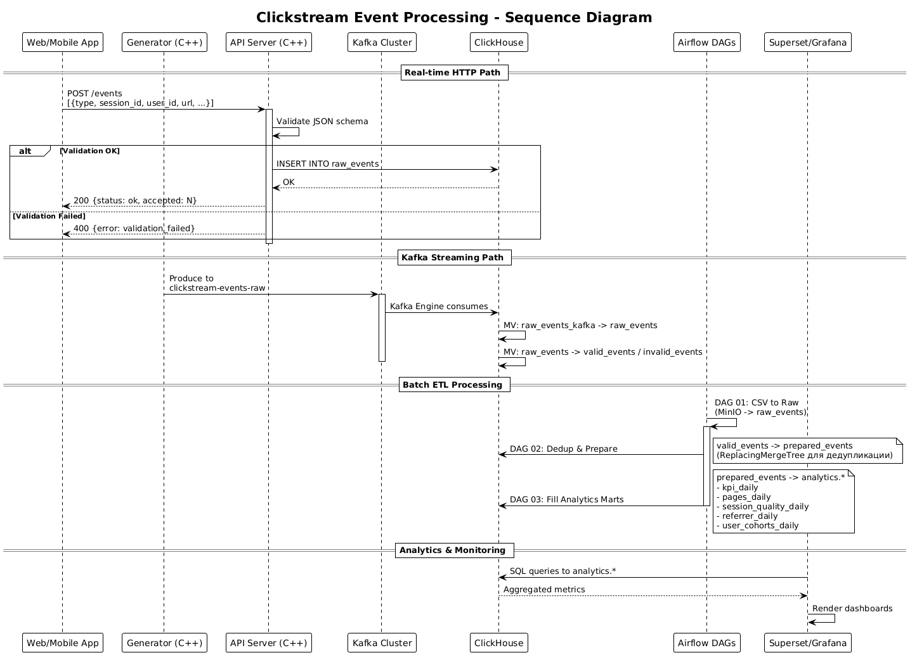

**3. Activity Diagram** — [activity.puml](docs/diagrams/activity.puml)
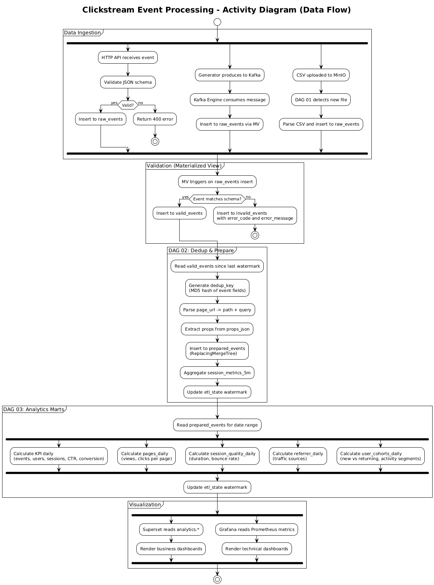

#### Схемы баз данных

DBML-схема всех таблиц: [docs/diagrams/clickhouse.dbml](docs/diagrams/clickhouse.dbml)
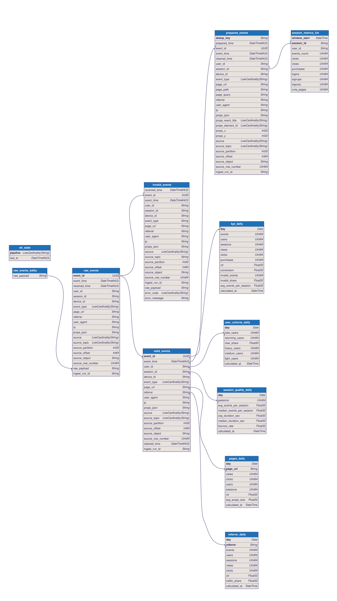

#### Описание API

Коллекция Postman Collection: [api/postman_collection.json](api/postman_collection.json)

**Включённые запросы:**
- Health Check
- Metrics
- Send Events (VALID / contract)
- Send Events (INVALID: unknown field)
- Send Events (INVALID: missing required fields)

---

### Тестирование

#### Подход к тестированию

1. **Unit-тесты**: Pytest для Airflow DAGs, проверка SQL-логики
2. **Integration-тесты**: Postman collection для E2E тестов API
3. **Load-тесты**: C++ generator для нагрузочного тестирования

#### Отчёты о покрытии

Отчёты находятся в [docs/proj-coverage/](docs/proj-coverage/):

- [api_generator_coverage.png](docs/proj-coverage/api_generator_coverage.png) — покрытие api и generator
- [airflow_coverage.png](docs/proj-coverage/airflow_coverage.png) — покрытие Airflow DAGs
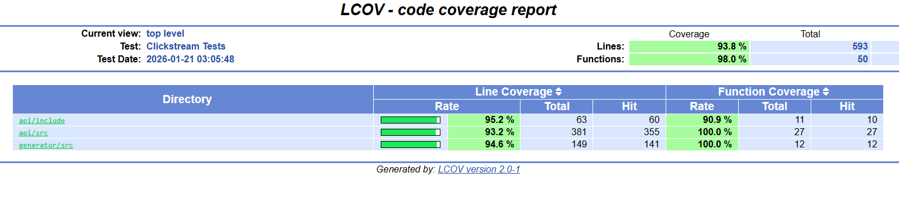
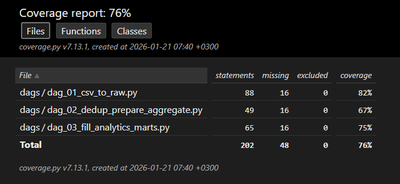

Запуск тестов Airflow:
```bash
cd airflow
pytest tests/ -v --cov=dags --cov-report=html
```

Запуск unit/интеграционных тестов API и генератора:
```bash
cd api
mkdir -p build && cd build
cmake .. -DCOVERAGE=ON
make -j$(nproc)
./tests
```

#### Тестовые данные

Файлы с тестовыми данными находятся в [dataset/](dataset/):

- [sample_events.json](dataset/sample_events.json) — примеры JSON-событий для API
- [events_contract_v1_*.csv](dataset/) — CSV-файл с 5000 событиями для batch-загрузки

#### Postman Collection

Коллекция для тестирования API: [api/postman_collection.json](api/postman_collection.json)

**Включённые запросы:**
- Health Check
- Metrics
- Send Events (VALID / contract)
- Send Events (INVALID: unknown field)
- Send Events (INVALID: missing required fields)

---

## Скриншоты

- Airflow оркестрация DAG-ов: 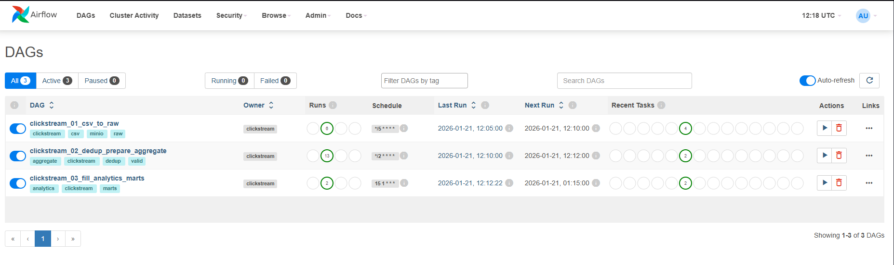
- Сырые события в ClickHouse: 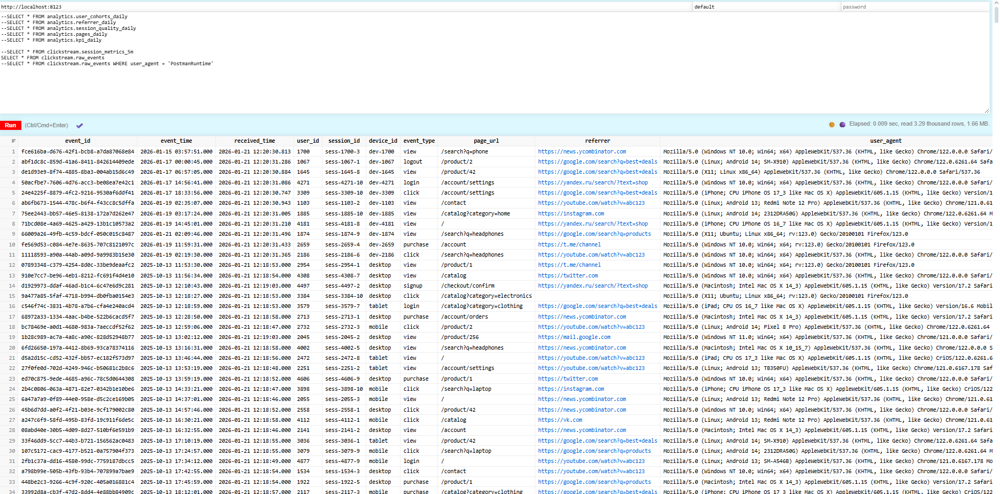
- Датамарт analytics.kpi_daily в ClickHouse: 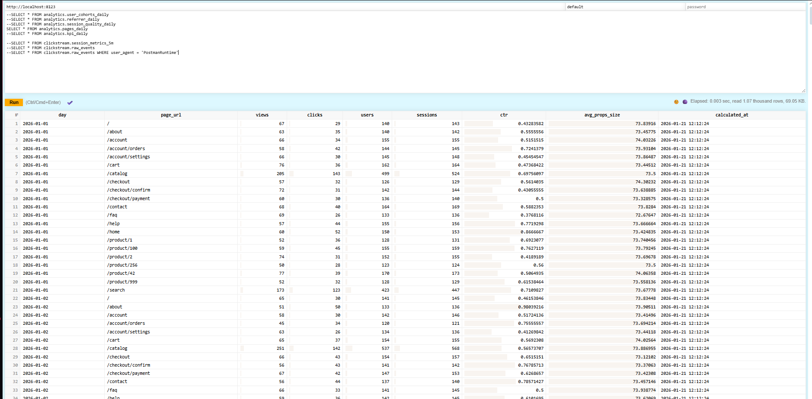
- Мониторинг в Grafana: 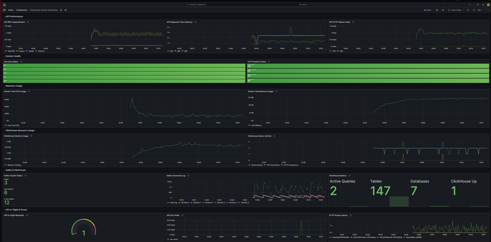
- Метрики Prometheus: 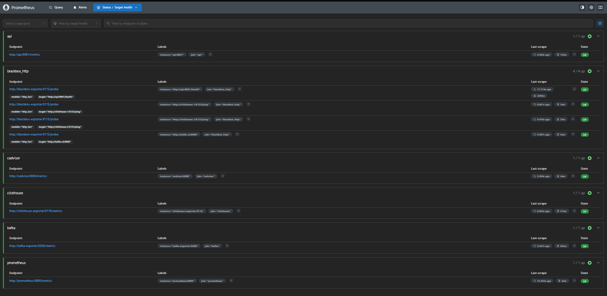
- Проверка API в Postman: 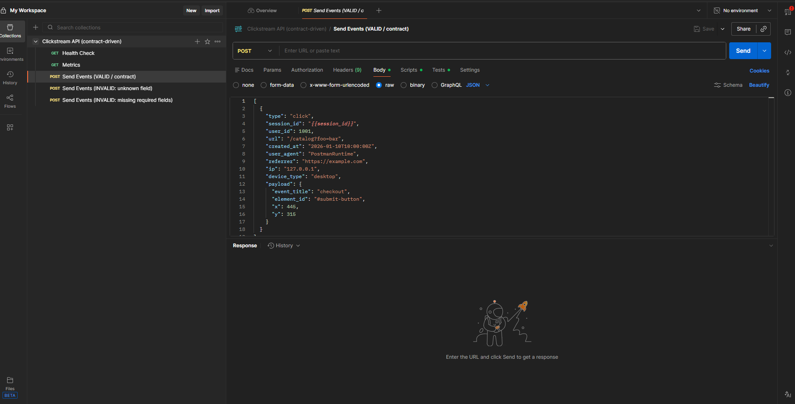
- Дашборд в Superset: 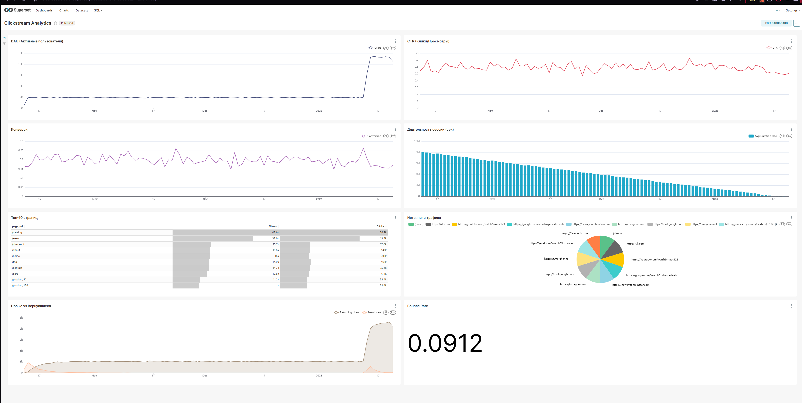
---

## Заключение

### Краткие выводы

Реализована полнофункциональная система clickstream-аналитики с:
- **Real-time ingestion**: <5ms latency для HTTP API
- **Batch processing**: инкрементальная обработка с watermark
- **Analytics**: 5 аналитических витрин с ежедневным обновлением
- **Monitoring**: полная observability через Prometheus/Grafana

**Эффективность по уровням нагрузки:**

| Нагрузка | RPS | Latency P99 | Рекомендации |
|----------|-----|-------------|--------------|
| Low (10K DAU) | ~6 | <10ms | 1 API instance, 1 Kafka broker |
| Medium (100K DAU) | ~60 | <20ms | Текущая конфигурация |
| High (1M DAU) | ~600 | <50ms | Горизонтальное масштабирование Kafka/ClickHouse |

### Результаты

1. Многоканальный ingestion (HTTP, Kafka, CSV)
2. Валидация событий с детальными ошибками
3. Дедупликация через ReplacingMergeTree
4. 5 аналитических витрин (KPI, pages, sessions, referrers, cohorts)
5. Бизнес-дашборды в Superset
6. Технический мониторинг в Grafana
7. Автоматизированное тестирование

### Перспективы развития

- **Масштабирование**: горизонтальное масштабирование ClickHouse (шардирование) и Kafka для высоких нагрузок
- **Безопасность**: внедрение TLS, RBAC и маскирование персональных данных
- **Расширение аналитики**: добавление funnel-анализа, A/B-тестирования и ML-моделей
- **Real-time**: потоковые алерты и streaming-обработка событий

---
